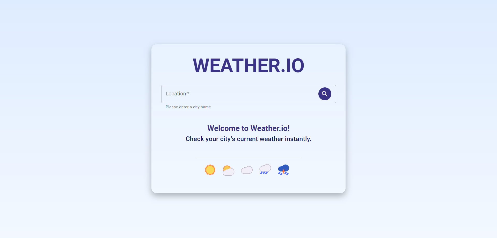
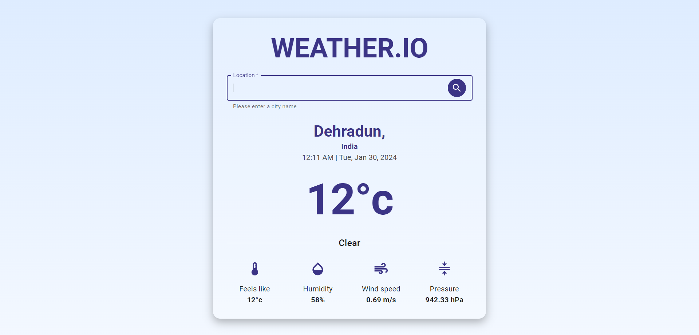

# Weather.io - Realtime Weather Information App

Weather.io is a simple React application designed to provide users with real-time weather information for a specified location. Utilizing Material UI components for an intuitive and responsive user interface, the app seamlessly integrates with the Tomorrow.io real-time weather API to deliver accurate and up-to-date weather data.

## Features

1. Realtime Weather Data
2. User-Friendly Interface
3. Tomorrow.io Integration

## Technologies Used

- React
- Material UI
- Tomorrow.io Realtime Weather API

## Installation

1. Clone this repository on your local machine.

2. Install dependencies: `npm install`

3. Set up Tomorrow.io API key: Obtain an API key from Tomorrow.io and update it in the app.

4. Start the development server: `npm run dev`

5. Open your web browser and visit `http://localhost:3000` to access the application.
